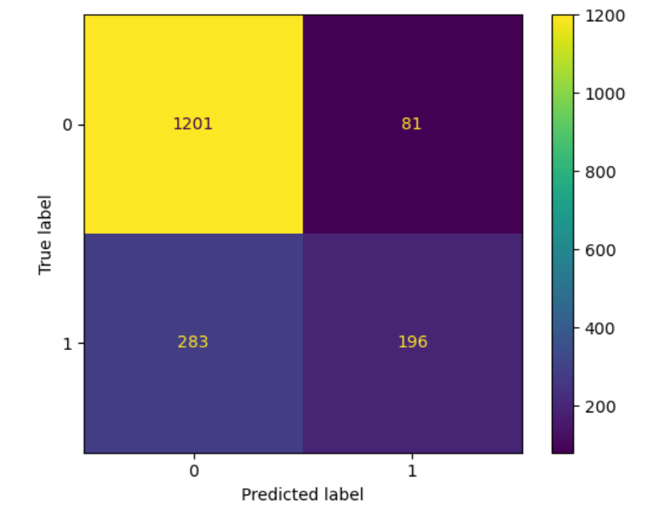
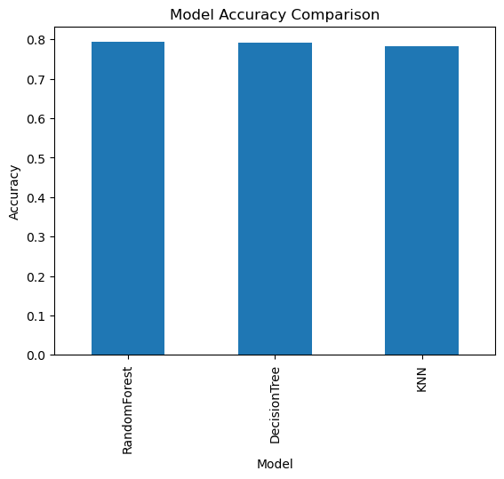
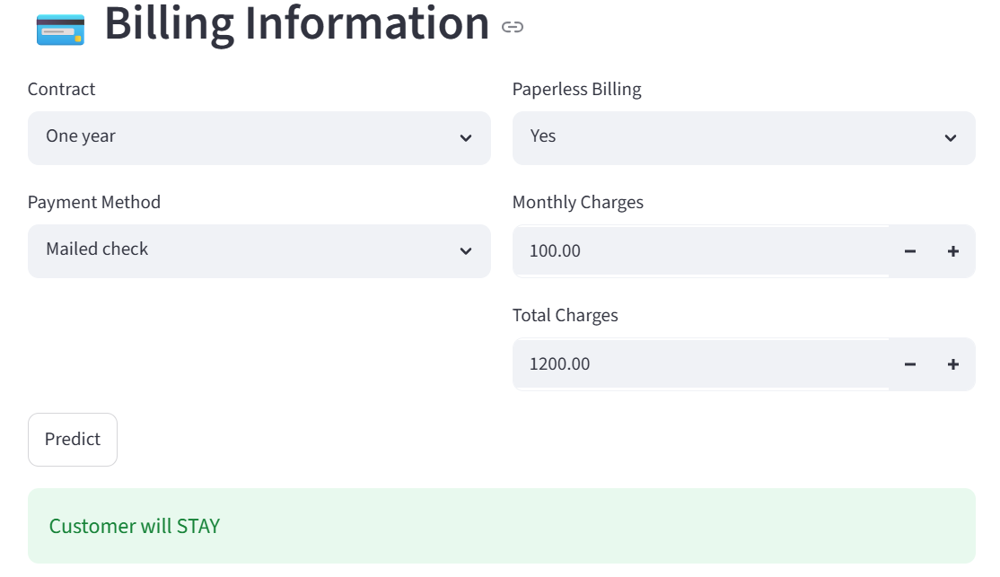

# Customer Churn Prediction using Machine Learning

## 🧠 Project Overview
This project predicts whether a customer will churn based on service usage, billing, and contract information using machine learning models. The best-performing model is selected using GridSearchCV and evaluated using accuracy.

---

## ⚙️ Tech Stack
- Python
- Pandas
- NumPy
- Scikit-learn
- Matplotlib
- Streamlit
- Joblib

---

## 📊 Problem Statement
Customer churn occurs when customers stop using a service. The goal is to predict churn using customer demographics, service subscriptions, and billing information.

---

## 📁 Project Workflow
- Data Cleaning
- Feature Engineering
- One-Hot Encoding
- Train-Test Split
- Model Training
- Hyperparameter Tuning (GridSearchCV)
- Model Evaluation
- Deployment using Streamlit

---

## 🤖 Models Used
- K-Nearest Neighbors (KNN)
- Decision Tree Classifier
- Random Forest Classifier

---

## 🏆 Best Model
Random Forest Classifier achieved the best performance.

- Accuracy: ~0.79
- Best Parameters:
  - n_estimators: 50
  - max_depth: 5

---

## 📸 Results

### Confusion Matrix


### Model Comparison


### Streamlit App


## 🌐 Live Demo
https://ml-churn-prediction-model-dlkqundzb47vca4gmgajnb.streamlit.app/

---

## 🚀 How to Run This Project

```bash
pip install -r requirements.txt
streamlit run app.py
```

## 👨‍💻 Author

Built by Talha Usmani